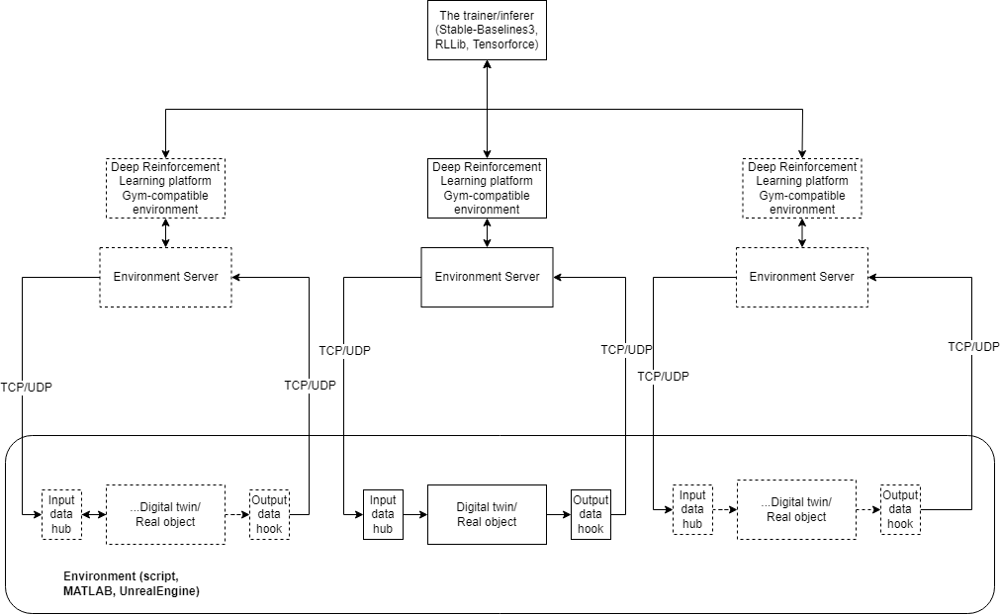

# Deep Reinforcement Learning Platform
The platform for creating gym-compatible environments with external applications, such as Simulink, Unity, Unreal Engine

The platform has been created as a part of Master's thesis for TalTech 2022.

The main principle of the deep reinforcement learning platform is to provide the general interface for communications with external applications. The platform implements several types of environment service, which are used to communicate with external agents.

This project focuses only on environment representation, leaving the choice for the trainer to the end user.

The description of API is given in the Github Wiki.